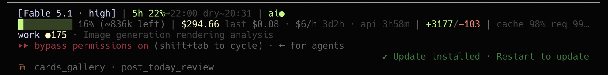
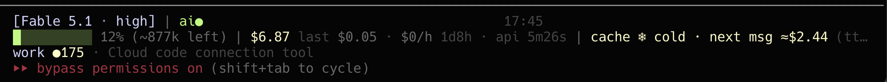
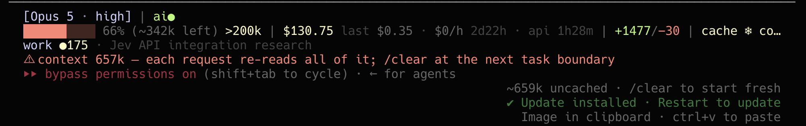

# claude-code-statusline

A status line for [Claude Code](https://code.claude.com) that shows what a
long session actually costs — and warns *before* the expensive thing happens,
not after. It also sees past the one session: the other Claude Code sessions
on the machine, what they burn together against the shared limits, and who
else is working on the same checkout.

```
[Fable 5.1 · high] | 5h 21%→Sun 00:10 dry~23:35 · 7d 60%→Wed dry~Tue 19h early | ai● · q4 pub 20h
█░░░░░░░░░ 17% 827k left | $7.46 last $0.25 api 14m31s/1d4h | +54/−3 · acct $15/h · 5 sessions
main ●13 +29 · 3 sessions here · Claude Code dashboard status line | cache 96% req 98% ttl59m
🔒 card-gen · RE dry run: comparison card until 20:22 — no container recreate
```



When the prompt cache has expired, the cache segment turns into a price:



And on a 1M-token window, a warning by token count rather than by percentage
(70% of 1M is already 700k tokens re-read on every request):



## Why

Over 53 days and 68,700 requests of my own transcripts, the prompt-cache hit
ratio was already **97.5%** — Claude Code's caching works. What cost money was
the other 2.5%: **1,119 cache rebuilds, $4,612 at list price, 24% of all spend.**
57% of that came from one cause: leaving a 400k+ session idle for over an hour,
then sending one more message. Another 24% came from switching models mid-session.

Both are avoidable if you can see them coming. Full numbers and method:
[docs/cache-economics.md](docs/cache-economics.md).

The second thing that cost me was invisible from inside any one session: with
eight sessions open across four repos, the 5-hour and 7-day limits are shared,
two sessions on one checkout switch branches and recreate containers under
each other, and a session's own `$/h` says nothing about the account. So every
session now leaves a card, and each reads the others.

## What each number means

**Line 1 — model, limits, health, clock**

| Segment | Meaning |
|---|---|
| `[Fable 5.1 · high ⚡]` | model, effort level, ⚡ = fast mode, `no-thinking` when extended thinking is off |
| `5h 22%→22:00` | 5-hour rate limit used, and when it resets (`→Sun 00:10` when that is another day) |
| `dry~20:31` | at the current burn rate you hit 100% at 20:31 — red if within the hour. Hidden below 20% used, or when it lands in the last 15 min before reset |
| `7d 58%→Wed dry~Tue 15h early` | weekly limit, shown from 30%; same projection, in days. Running dry before the reset is a lockout of that many hours, so it is yellow at any distance and red within a day |
| `ai● · q4 pub 20h` | output of your optional health hook (see below) |
| `17:45` | clock, right-aligned, kept 45 columns clear of Claude Code's own notifications |

**Line 2 — context and money**

| Segment | Meaning |
|---|---|
| `█░░░░░░░░░ 16% 836k left` | context used; bar colour by tokens on a 1M window (yellow 300k, red 500k), by % on 200k |
| `>200k` | past 200k tokens: slower requests, long-context pricing |
| `$294.66` | session cost at API list price (what the same traffic would cost without a subscription) |
| `last $0.08` | cost of the last request — what one message costs at *this* context size |
| `$6/h` | spend over the last hour of wall time; hidden when idle |
| `api 3h58m/3d2h` | time the model actually worked / time the session has existed |
| `+3177/−103` | lines added / removed this session |
| `acct $15/h · 5 sessions` | spend over the last hour summed across every live session on this machine. The 5h/7d limits are shared, yet each session only sees its own spend; this is the figure the limits actually move on |

**Line 3 — where the work is, and the cache**

| Segment | Meaning |
|---|---|
| `work ●92 +85` | branch, modified files, untracked files (cached 30s). Catches another session switching the branch under you |
| `⎇ name` / `@agent` / `PR #12 ✓approved` | worktree, agent, PR with review state (clickable link) — only when set |
| `+1 dir` | directories attached with `/add-dir` |
| `3 sessions here (Commenting workflow ana…)` | other live sessions launched from this project, by name. Two sessions on one checkout is how a branch gets switched, or containers recreated, under a run |
| `cache 98%` | lifetime share of input tokens served from cache |
| `req 98%` | the same for the **last request** — turns yellow under 50%, meaning that request paid to rebuild the prefix |
| `ttl59m` | how long a pause can last before the next message re-caches; yellow under 5 min |
| `4 miss ≈$10 (ttl_expired_1h×2,model_changed)` | cumulative misses, what re-caching after them cost, and why |
| `cache ❄ cold · next msg ≈$6.59` | cache expired; what the next message will cost to rebuild, at the write rate of the cache's own TTL (2× for 1h, 1.25× for 5m) |

**Line 4 — only when something needs attention**, in this order:

- `model switch at 708k re-caches everything ≈$14 — /clear first if the task allows`
- `⚠ 5h limit 87% — work stops at 100%`
- `🔒 card-gen · RE dry run … until 20:22 — no container recreate` — an unexpired run lock in `<project>/.claude/run-locks/<name>.lock` (a file with `expires_epoch=` and `what=` lines; write it from whatever protects your long runs). A limit warning always wins over it
- `⚠ context 657k — each request re-reads all of it; /clear at the next task boundary`

Lines 2 and 3 are trimmed to the terminal width by priority: the least
important segments (miss causes, other sessions' names, `+N dir`, `last`,
`$/h`, session name) drop first, whole. Branch, total cost and a cold cache
are never dropped. Lines 1 and 4 are not trimmed; under about 85 columns
they wrap.

**Subagent rows** (`subagent-statusline.sh`):

```
Map comment pipeline + observab… - haiku 4.5·low - 154k (77%) - 10m50s - running
Review diff - opus 5.5 - 181k (90%) - 1h1m - running stalled?
```

The task description, model, tokens as a share of that agent's context (yellow
at 70, red at 90), elapsed, status. `stalled?` appears when a running agent's
token count has not moved for 6 ticks — hung on a tool, or waiting. The
description is cut to the row width Claude Code reports; the numbers never are.

**Session registry.** Every run leaves a card for its session in
`~/.claude/cache/statusline_sessions/` (name, model, project, spend, the
Claude Code pid). Other sessions read the cards for the `acct` and
`sessions here` segments. A card is live while its pid is; dead cards are
removed on the next read, and nothing else reads them.

## Install

Requires `bash`, `jq`, and Claude Code ≥ 2.1. macOS and Linux.

```bash
git clone https://github.com/vitamin33/claude-code-statusline
cd claude-code-statusline && ./install.sh
```

`install.sh` copies both scripts to `~/.claude/`, backs up the previous ones
and your `settings.json`, and sets:

```json
"statusLine":         { "type": "command", "command": "~/.claude/statusline.sh", "refreshInterval": 60, "hideVimModeIndicator": true },
"subagentStatusLine": { "type": "command", "command": "~/.claude/subagent-statusline.sh" }
```

`refreshInterval` keeps the TTL countdown and the clock moving while a session
is idle. `hideVimModeIndicator` is set because the script renders the vim mode
itself.

The script runs in ~100 ms. It writes only under `~/.claude/cache/`: per-session
cost logs, a 30-second git cache, the session cards, one raw input snapshot for
debugging, and two logs that nothing renders yet (below). Anything older than
7 days is pruned.

## Health hook (optional)

Put an executable at `~/.claude/statusline-health.sh` that prints **one short
line** (ANSI colours allowed). It can be slow — it runs detached at most every
10 minutes, and the status line only reads its last output. Output older than
30 minutes is shown dimmed with a `?`.

Mine watches my product: AI calls in production (all calls of a feature
failing in the last hour = Anthropic credit exhausted, which is an HTTP 400),
the drafts waiting for approval (`q0` is yellow — no draft in 48h means
generation died, which once went unnoticed for a day), the age of the last
publish, and failed posts. The shape is:

```bash
#!/bin/bash
cd ~/src/myproduct || exit 1
ai=$(python ops/ai_health.py --hours 1 --json) || exit 1
q=$(python ops/queue_stats.py --json) || exit 1
printf '%s · %s\n' \
  "$(echo "$ai" | jq -r 'if (.dark_features|length) > 0 then "\u001b[31mai✗\u001b[0m" else "\u001b[32mai●\u001b[0m" end')" \
  "$(echo "$q"  | jq -r 'if .pending == 0 then "\u001b[33mq0\u001b[0m" else "q\(.pending)" end + " pub \(.pub_age_h)h"')"
```

A deploy status, a queue depth, or a CI run work the same way.

## Tests

```bash
tests/run.sh              # golden cases under tests/cases/<name>/
UPDATE=1 tests/run.sh     # re-record after an intended change; review the diff
```

Each case pipes an `input.json` through the script with a frozen clock
(`STATUSLINE_NOW`), UTC, a throwaway `HOME` and a fixed width, and compares the
colour-stripped output with `expected.txt`. A case can add `cards` (other
sessions' registry cards), `lock` (a run lock) and `columns`. Cases cover a
warm session, a cold cache after a model switch, a narrow terminal, other live
sessions, a run lock, the docs' minimal input, and subagent rows. CI runs them
on Ubuntu and macOS; they need the `en_US.UTF-8` locale for width measurement.

## Logged, not yet rendered

Two things are recorded so a decision can be made on data rather than a guess:

- `~/.claude/cache/statusline_ratelimit.log` — the 7-day limit reading over
  time, one row whenever it rises (an idle session reports a stale, lower
  figure, so only rises within one window are kept). The `dry~` projection is
  a flat average since the window opened; a last-24h slope may predict the
  reset better, and will only replace it if it does out of sample.
- `~/.claude/cache/subagent_ticks.log` — one line per subagent status-line
  tick, to learn the interval the "6 ticks" stalled heuristic assumes.

## Measure your own cache

```bash
python3 analyze_cache.py                                    # last 60 days, per day
python3 analyze_cache.py --since 2026-08-01 --causes        # why each rebuild happened
python3 analyze_cache.py --split 2026-09-21                 # before / after a change
```

It reads `~/.claude/projects/**/*.jsonl`, takes one usage record per request,
and prices it at the public list rates (edit `PRICES` when they change). See
[docs/cache-economics.md](docs/cache-economics.md) for what the columns mean
and what mine showed.

## Fields used

Everything comes from the JSON Claude Code pipes to the status line:
`model`, `effort`, `fast_mode`, `thinking`, `context_window` (incl.
`current_usage`), `exceeds_200k_tokens`, `cost`, `rate_limits`, `prompt_cache`
(`warm`, `ttl`, `expires_at`, `hit_ratio`, `misses`, `miss_causes`,
`last_miss_cause`, `miss_recache_tokens`, `recache_tokens_if_cold`),
`workspace` (`project_dir`, `added_dirs`), `worktree`, `agent`, `pr`,
`session_id`, `session_name`, `vim`. The subagent script uses `columns` and,
per task, `description`, `model`, `effort`, `tokenCount`, `tokenSamples`,
`contextWindowSize`, `startTime`, `status`.
Documented at <https://code.claude.com/docs/en/statusline>.

## License

MIT
